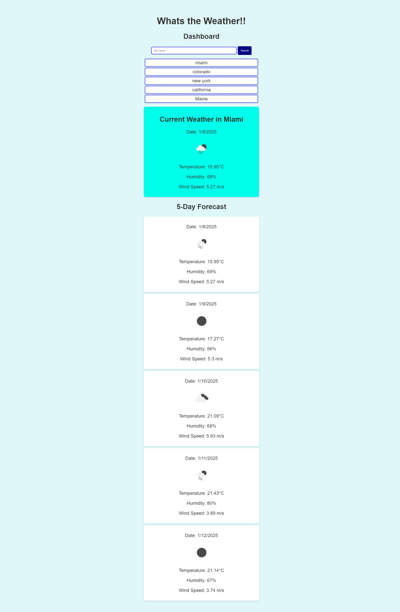

# Whats The Weather !! ( Module 6 )  

## Description

Welcome to Whats the Weather !! if you are trying to find out what is the weather for the next 5 days, this is the place! i am using an API to call for the forcast5, that way you see that is the weather for real from a legitimate soruce. Its build from HTML, CSS, and JavaScript which is where I am calling the API and all the work is being done! So input your city and cehck what the weather is going to be in the next 5 days.

## Acceptance Criteria

GIVEN a weather dashboard with form inputs
WHEN I search for a city
THEN I am presented with current and future conditions for that city and that city is added to the search history
WHEN I view current weather conditions for that city
THEN I am presented with the city name, the date, an icon representation of weather conditions, the temperature, the humidity, and the wind speed
WHEN I view future weather conditions for that city
THEN I am presented with a 5-day forecast that displays the date, an icon representation of weather conditions, the temperature, the wind speed, and the humidity
WHEN I click on a city in the search history
THEN I am again presented with current and future conditions for that city
Mock-Up

## link

https://openweathermap.org/forecast5

note: make an account to create your API key

## Installation 

1. create a GitHub
2. name it Whats The Weather !!  ( Module 6 ) 
3. clone it to me desktop
4. open on VScode and create a assets folder for css and js
5. then the index for HTML
6. then work on each starting with html, then css, and JavaScript
7. make sure they are linked to each other
8. include the API. found in the link given up above
9. chekc and make sure you input everything correctly
10. run it and test it, checking the code
11. create the Readme 
12. after push to GitHub 

* The image shows what it looks like :

